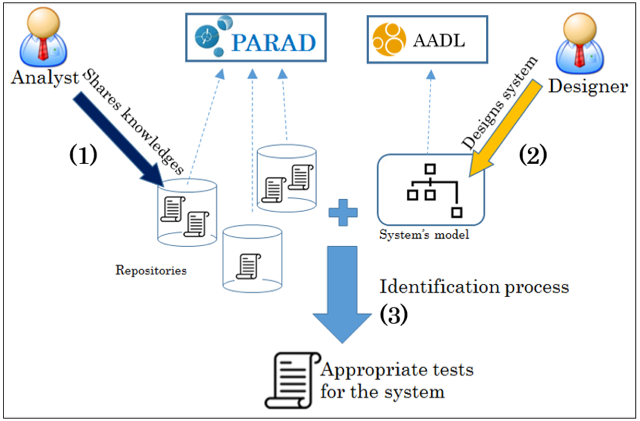

# PARAD: Model-based Performance Analysis Repositories for Aadl Designs

PARAD (Performance Analysis Repository for Aadl Designs) is a framework under development at LIAS, ENSMA. PARAD presents a new collaborative approach to the problem of automatically finding appropriate tests for a given system design which is always led by experience of designers. The new approach consists in construction of an Analysis Repository which capitalizes efforts of analysts. The analysts describes their analyses and the accompanied assumptions using PARAD's concepts.

## Core concepts

*ContextModel* (or Context  in short) represents the analysis situation of system that let us know about what scheduling theory can be used to model the system and which analysis technique can be used to analyze the system.

*Test* represents an analysis technique to analyze the system. Since *ContextModel* represents analysis situation, in a Context  a number of *Tests* is available. TestImplementation represents an implementation of Test on an analysis tool such as _RtDruid_, _Simso_, _MAST_ and _Cheddar_, etc.

*IdentificationRule* is the cornerstone concept of PARAD. An *IdentificationRule* represents an assumption on the system. The assumptions of scheduling theory that a *ContextModel* represents can be interpreted by a list of *IdentificationRules* with the expected value. To a *Context*, the expected value of IdentificationRule  on a system can be true if this *IdentificationRule* corresponds to any assumption of the Context or false if this *IdentificationRule* is contradictory to any assumption or indifferent if this *IdentificationRule* has no relation with all assumptions that the Context ensures.

We also provide some important characteristics of *Test* to a *ContextModel*.

* A *Test* is sufficient to a Context if the success of this test in this Context is enough to conclude that the system is schedulable.
* A *Test* is necessary to a Context if the failure of this test in this Context is enough to conclude that the system not schedulable.
* A *Test* is exact to a Context if it is both sufficient and necessary.

We also consider sustainability aspect. Sustainability is the capability of maintaining the analysis results after possitively changing analysis parameters such as _period_, _dealine_ and _execution-time_, etc.

## Identification Process

Identification Process is the way that PARAD seeks for appropriate Context for a given system designed in AADL. This process is composed of two steps.

* The first step consists in evaluating the list of identification rules on the system.
* The second step consists in comparing the obtained evaluation value of each rule with its expected value in a Context.

The appropriate Context is the one which has all expected value satisfied.

To be automatable, the IdentificationRule must be interpreted in a formalism that the machine can process. We opt for the constraint language OCL and LUTE due to their large utility for querying AADL model. At this state of PARAD, Users can choose one from these two formalisms to interpret their assumptions.

## User manual

Users can contribute their own analysis in form of java executable file (*.jar). To be acceptable by PARAD, the result of analysis must be interpreted in a specific formalism whose meta-model can be found here _AnalysisResult.ecore_.

To be used by PARAD, users simply describe their analyses in PARAD's formalism and link the location of Java executable file (.jar) to each instance of _TestImplementation_.

The information of analysis needed by PARAD are :

* Priority (Optional)
* Utilization factor (Optional)
* Response time (Optional)
* Completion type(Mandatory)

Completion type is the finish state of analysis, it can be fail or succeed. Due to this property, we can deduce schedulability of studied system.

## Software licence agreement

Details the license agreement of PARAD: [LICENCE](LICENCE)

## Historic Contributors

* [Yassine OUHAMMOU](https://www.lias-lab.fr/fr/members/yassineouhammou/)
* [Thanh-Dat NGUYEN](https://www.lias-lab.fr/fr/members/thanhdatnguyen/)

## Code analysis

* Programming Language: Java, EMF models.
